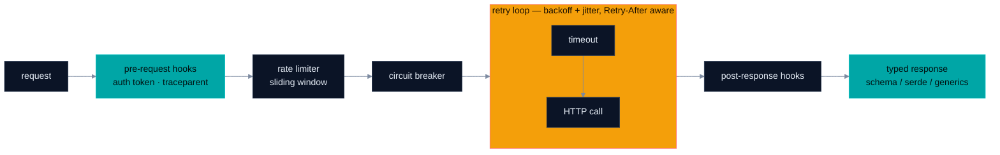

<p align="center">
  <a href="https://smoo.ai"></a>
</p>

<p align="center">
  <a href="https://www.npmjs.com/package/@smooai/fetch"></a>
  <a href="https://pypi.org/project/smooai-fetch/"></a>
  <a href="https://crates.io/crates/smooai-fetch"></a>
  <a href="https://www.nuget.org/packages/SmooAI.Fetch"></a>
</p>

<p align="center">
  <a href="https://smoo.ai"></a>
  <a href="./LICENSE"></a>
  <a href="https://github.com/SmooAI/fetch/actions/workflows/release.yml"></a>
</p>

<p align="center">
  
  
  
  
  
</p>

<p align="center">
  
  
  
  
</p>

<p align="center">
  <a href="#what-is-this"><b>What it is</b></a> &nbsp;·&nbsp;
  <a href="#feature-tour"><b>Feature tour</b></a> &nbsp;·&nbsp;
  <a href="#-install"><b>Install</b></a> &nbsp;·&nbsp;
  <a href="#-quickstart-in-your-language"><b>Quickstart</b></a> &nbsp;·&nbsp;
  <a href="#five-languages-honestly"><b>Language status</b></a> &nbsp;·&nbsp;
  <a href="#-examples"><b>Examples</b></a> &nbsp;·&nbsp;
  <a href="#-part-of-smoo-ai"><b>Platform</b></a>
</p>

---

> **Stop writing the same retry logic over and over.** `@smooai/fetch` is a drop-in `fetch` that survives the reality of network failures — exponential backoff with jitter, timeouts, `Retry-After`-aware rate-limit handling, circuit breaking, lifecycle hooks, and typed responses — with **native ports in five languages**: TypeScript, Python, Rust, Go, and .NET. Same semantics everywhere; each port built idiomatically for its ecosystem.

Traditional `fetch` gives you the request, but leaves you to handle the reality of flaky APIs, slow endpoints, and rate limits. `@smooai/fetch` handles them by default.

## What is this?

One resilient HTTP client, ported natively to five languages. Every port carries the same core behaviors — verified against the source of each port, not aspirational:

- 🔄 **Smart retries** — exponential backoff with jitter to prevent thundering herds; retries only on network errors and retryable statuses
- ⏱️ **Automatic timeouts** — never hang indefinitely on slow endpoints (10s default, configurable per request)
- 🚦 **Rate-limit respect** — reads `Retry-After` headers and waits exactly what the server asked, plus a client-side sliding-window rate limiter
- 🔌 **Circuit breaking** — stop hammering services that are clearly down
- 🔗 **Lifecycle hooks** — pre-request / post-response hooks for auth, logging, and metrics
- 🔑 **Async auth token provider** — register a token callback once; every request picks up a fresh token
- 📡 **W3C trace-context propagation** — `traceparent` headers injected automatically; OpenTelemetry is an _optional_ integration in every port, never a hard dependency
- 🎯 **Typed responses** — response typing and validation in every language, with mechanics that differ per ecosystem (see the [honest matrix](#five-languages-honestly))

## Feature tour

Each capability in a few lines of real, current API — snippets are verified against [`src/`](./src/) and the language ports, not pseudocode.

|     | Capability                                           | What you get                                           |
| --- | ---------------------------------------------------- | ------------------------------------------------------ |
| 🔄  | [**Smart retries**](#-smart-retries)                 | Backoff + jitter, only on errors worth retrying        |
| 🚦  | [**Rate-limit respect**](#-rate-limit-respect)       | `Retry-After` honored to the second, in all five ports |
| 🔌  | [**Circuit breaking**](#-circuit-breaking)           | Fail fast when a dependency is down                    |
| 🎯  | [**Typed responses**](#-typed-responses--validation) | Schema-validated data, typed end to end                |
| 🔗  | [**Hooks + auth**](#-lifecycle-hooks--auth)          | One place for tokens, logging, and response policy     |
| 📡  | [**Trace propagation**](#-trace-context-propagation) | `traceparent` on every request, optional OpenTelemetry |

### 🔄 Smart retries

```typescript
import fetch from '@smooai/fetch';

// This won't crash if the API is temporarily down
const response = await fetch('https://flaky-api.com/data');

// Behind the scenes:
// Attempt 1: 500 error — waits ~500ms (jittered)
// Attempt 2: 503 error — waits ~1000ms
// Attempt 3: 200 success ✅
```

Defaults (TypeScript): 2 automatic retries, exponential backoff starting at 500ms with factor 2, jitter to prevent thundering herds, and retries only on network errors or retryable HTTP statuses.

### 🚦 Rate-limit respect

```typescript
const response = await fetch('https://api.github.com/user/repos');

// If GitHub says "slow down":
// - Sees 429 + Retry-After: 60
// - Automatically waits 60 seconds
// - Retries and succeeds
```

All five ports parse `Retry-After` and wait what the server asked instead of the default backoff. A client-side sliding-window rate limiter (`withRateLimit(100, 60000)`) keeps you from hitting the ceiling in the first place.

### 🔌 Circuit breaking

```typescript
import { FetchBuilder } from '@smooai/fetch';

const criticalAPI = new FetchBuilder()
    .withCircuitBreaker({
        failureRateThreshold: 50, // open when ≥50% of calls fail…
        slidingWindowSize: 10, // …across the last 10 calls
        openStateDelayMs: 30000, // stay open 30s, then trial a half-open call
    })
    .build();

try {
    await criticalAPI('https://payment-processor.com/charge');
} catch (error) {
    // Circuit is open — service is down. Show fallback UI immediately.
}
```

### 🎯 Typed responses + validation

```typescript
import { z } from 'zod';

const UserSchema = z.object({
    id: z.string(),
    email: z.string().email(),
});

const response = await fetch('https://api.example.com/user', {
    options: { schema: UserSchema },
});

// response.data is fully typed as { id: string; email: string }
// No more runtime surprises in production
```

In TypeScript, `schema` accepts **any [Standard Schema](https://github.com/standard-schema/standard-schema) validator** — Zod, Valibot, ArkType. The other ports type responses with their ecosystem's native tools; the [language matrix](#five-languages-honestly) says exactly which.

### 🔗 Lifecycle hooks + auth

```typescript
const api = new FetchBuilder()
    .withAuthTokenProvider(async () => await tokenStore.getFreshToken(), 'Bearer')
    .withHooks({
        postResponseError: (url, init, error) => {
            if (error.response?.status === 401) {
                refreshToken(); // Token expired — refresh and retry
            }
            return error;
        },
    })
    .build();
```

Every port has both seams: an async auth-token provider (fresh token per request, no client rebuild) and pre-request / post-response hooks.

### 📡 Trace-context propagation

Every port injects a [W3C `traceparent`](https://www.w3.org/TR/trace-context/) header when a trace is active, so your HTTP calls join the distributed trace automatically. OpenTelemetry is an **optional** peer/feature in each language — the client works identically without it installed.

```typescript
// With @opentelemetry/api installed and a span active:
await api('https://api.example.com/users/123');
// → headers: { traceparent: '00-<trace-id>-<span-id>-01' }
// Without it: same request, no traceparent, zero errors.
```

### The request pipeline



---

## 📦 Install

| Language   | Package                                                        | Install                                      |
| ---------- | -------------------------------------------------------------- | -------------------------------------------- |
| TypeScript | [`@smooai/fetch`](https://www.npmjs.com/package/@smooai/fetch) | `pnpm add @smooai/fetch`                     |
| Python     | [`smooai-fetch`](https://pypi.org/project/smooai-fetch/)       | `pip install smooai-fetch`                   |
| Rust       | [`smooai-fetch`](https://crates.io/crates/smooai-fetch)        | `cargo add smooai-fetch`                     |
| Go         | `github.com/SmooAI/fetch/go/fetch/v3`                          | `go get github.com/SmooAI/fetch/go/fetch/v3` |
| .NET       | [`SmooAI.Fetch`](https://www.nuget.org/packages/SmooAI.Fetch)  | `dotnet add package SmooAI.Fetch`            |

> **Go note:** the module path carries the `/v3` major suffix Go requires above v1, so the `go/fetch/v3.x` tags resolve. The import path is `github.com/SmooAI/fetch/go/fetch/v3`; the package identifier is still `fetch`. Tags minted before this change (through `go/fetch/v3.4.0`) point at commits whose `go.mod` lacked the suffix and will not resolve — use `v3.4.1` or later.

Language-specific source lives in [`src/`](./src/) (TypeScript), [`python/`](./python/), [`rust/`](./rust/), [`go/`](./go/), and [`dotnet/`](./dotnet/).

## 🚀 Quickstart, in your language

It's just `fetch`, but resilient — retries, timeout, and `Retry-After` handling are on by default in every port.

**TypeScript** ([full docs](#-examples))

```typescript
import fetch from '@smooai/fetch';

const response = await fetch('https://api.example.com/users/123');
const user = await response.json();
```

**Python** ([`python/`](./python/))

```python
from smooai_fetch import FetchBuilder

builder = FetchBuilder().with_timeout(5000).with_retry()
response = await builder.fetch("https://api.example.com/users/123")
```

**Rust** ([`rust/fetch/`](./rust/fetch/))

```rust
use smooai_fetch::fetch;
use smooai_fetch::types::RequestInit;

let response = fetch::<serde_json::Value>("https://api.example.com/users/123", RequestInit::default()).await?;
```

**Go** ([`go/fetch/`](./go/fetch/))

```go
client := fetch.NewClientBuilder().
    WithTimeout(10 * time.Second).
    WithRetry(&fetch.DefaultRetryOptions).
    Build()

resp, err := fetch.Get[User](ctx, client, "https://api.example.com/users/1", nil)
```

**.NET** ([`dotnet/SmooAI.Fetch/`](./dotnet/SmooAI.Fetch/))

```csharp
var fetch = SmooFetch.Create(options =>
{
    options.BaseUrl     = "https://api.example.com";
    options.RetryPolicy = RetryPolicy.ExponentialBackoff(maxRetries: 3);
});

var user = await fetch.GetAsync<User>("/users/me");
```

### Node.js and browser (TypeScript)

```typescript
// Node.js
import fetch from '@smooai/fetch';

// Browser — same API, different entry point
import fetch from '@smooai/fetch/browser';
const response = await fetch('/api/checkout', {
    method: 'POST',
    body: { items: cart },
});
```

---

## Five languages, honestly

Every port carries the shared core: **retries with backoff + jitter, `Retry-After` handling, timeouts, a sliding-window rate limiter, a circuit breaker, lifecycle hooks, an async auth-token provider, and W3C `traceparent` propagation**. The mechanics differ per ecosystem — same semantics, not byte-identical behavior:

| Language   | Response typing / validation                                                                                                                  | Resilience engine                                                             | HTTP stack                        |
| ---------- | --------------------------------------------------------------------------------------------------------------------------------------------- | ----------------------------------------------------------------------------- | --------------------------------- |
| TypeScript | Any [Standard Schema](https://github.com/standard-schema/standard-schema) validator (Zod, …)                                                  | [mollitia](https://github.com/genesys/mollitia)                               | native `fetch`                    |
| Python     | Pydantic models via `with_schema(...)`                                                                                                        | implemented in-package                                                        | httpx                             |
| Rust       | serde — `fetch::<T>` deserializes into your type                                                                                              | implemented in-crate                                                          | reqwest                           |
| Go         | Generics — `fetch.Get[User](...)` decodes into your struct, plus an optional `RequestOptions.Validate` hook returning `SchemaValidationError` | implemented in-package                                                        | net/http                          |
| .NET       | System.Text.Json — `GetAsync<T>` / `PostAsync<TReq, TRes>` (no pluggable validator)                                                           | [Polly](https://github.com/App-vNext/Polly) + `System.Threading.RateLimiting` | HttpClient / `IHttpClientFactory` |

Where a port leans on a battle-tested ecosystem library (mollitia, Polly), it says so above; the others implement retry/breaker/rate-limit logic natively, with each port's own test suite covering the shared behaviors.

### Credential redaction is scoped to what each port actually logs

| Language   | What it logs about a request                                                                | Redaction                                   |
| ---------- | ------------------------------------------------------------------------------------------- | ------------------------------------------- |
| TypeScript | method, host, path, query string, **headers**, **request body**, and the URL in the message | full — headers, query, URL and body         |
| Rust       | method and URL, on one `tracing::debug!` event                                              | URL only (userinfo password + query params) |
| Python     | nothing                                                                                     | n/a — no logging sink                       |
| Go         | nothing                                                                                     | n/a — no logging sink                       |
| .NET       | nothing (an `ILogger<SmooFetch>` is held for DI but never called)                           | n/a — no logging sink                       |

**This is not a parity gap.** Redaction exists in exactly the two ports that have something to redact. Adding a scrubber to Python, Go or .NET would be code no call site reaches — which reads as a guarantee while guaranteeing nothing. The shared cases in [`spec/redaction-corpus.json`](spec/redaction-corpus.json) are loaded by the TypeScript and Rust suites, and that file states the rule for anyone extending it: **if a logging sink is ever added to another port, wire it to this corpus in the same PR.**

---

## 📖 Smart defaults

Out of the box, `@smooai/fetch` is configured for the real world:

**Retry strategy** — 2 automatic retries, exponential backoff (500ms → 1s → 2s), jitter to prevent thundering herds, and retries only on network errors or retryable responses.

**Timeout protection** — 10-second default timeout, configurable per request, so requests never hang indefinitely.

**Connect timeout (opt-in)** — `connectTimeoutMs` / `withConnectTimeout` bounds only the connection-establishment phase, in all five ports. A black-holed connect then fails in ~that window and retry lands on a live endpoint, instead of burning the whole-request timeout on a dead one; slow-but-alive handlers are unaffected. Off by default. In TypeScript it needs the optional peer dependency `undici` and applies to Node only.

**Rate-limit handling** — respects `Retry-After` headers and backs off automatically on 429 responses.

### Graceful degradation

```typescript
const primaryAPI = new FetchBuilder().withCircuitBreaker({ failureRateThreshold: 50 }).build();
const fallbackAPI = new FetchBuilder().withTimeout(2000).build();

async function getWeather(city: string) {
    try {
        return await primaryAPI(`https://api1.weather.com/${city}`);
    } catch (error) {
        console.warn('Primary weather API failed, using fallback');
        return await fallbackAPI(`https://api2.weather.com/${city}`);
    }
}
```

## 🔗 Pairs with @smooai/logger

`@smooai/fetch` works with [@smooai/logger](https://github.com/SmooAI/logger) for complete observability across distributed systems.

### Automatic correlation ID propagation

```typescript
import fetch, { FetchBuilder } from '@smooai/fetch';
import { AwsServerLogger } from '@smooai/logger/AwsServerLogger';

const logger = new AwsServerLogger({ name: 'APIClient' });

const api = new FetchBuilder()
    .withLogger(logger) // That's it
    .build();

// In Service A
logger.info('Starting user flow'); // Correlation ID: abc-123
const user = await api('/users/123'); // Correlation ID sent as header

// In Service B, the correlation ID is automatically extracted and logs are linked.
```

### Credentials are redacted before they reach a log record

Everything this client logs about a request — headers, query string, URL and body — is scrubbed of credential-bearing keys first, so an OAuth token exchange or a `Bearer` header does not land in CloudWatch in plaintext. Redaction is always on and applies only to the logged copy; the request on the wire is untouched.

A key is redacted when its normalized form (lowercased, `-`/`_`/`.` stripped) contains `secret`, `password`, `passwd`, `token`, `apikey`, `authorization`, `credential`, `privatekey`, `assertion`, `cookie`, `session` or `signature`, or equals `auth`, `code`, `pwd` or `sig`. The cases are pinned in [`spec/redaction-corpus.json`](spec/redaction-corpus.json), which both the TypeScript and Rust test suites load. `client_id` is deliberately **not** redacted — it is public in OAuth and load-bearing when debugging.

The Rust client redacts the URL it logs (userinfo password + query params); the Python, Go and .NET clients log nothing about a request, so they have nothing to redact.

### Debug production issues faster

When something goes wrong, you have the complete story — initial request, each retry attempt, circuit-breaker state changes, and the final error with a full stack trace:

```typescript
try {
    const response = await api('/flaky-endpoint');
} catch (error) {
    logger.error('Request failed after retries', error);
}

// In your logs:
// {
//   "correlationId": "abc-123",
//   "message": "Request failed after retries",
//   "error": { "attempts": 3, "lastError": "TimeoutError", "circuitState": "open" },
//   "callerContext": { "stack": ["/src/services/UserService.ts:42:16"] }
// }
```

## 📚 Examples

- [Basic usage](#basic-usage)
- [FetchBuilder pattern](#fetchbuilder-pattern)
- [Retry](#retry-example)
- [Timeout](#timeout-example)
- [Rate limit](#rate-limit-example)
- [Schema validation](#schema-validation-example)
- [Lifecycle hooks](#lifecycle-hooks-example)
- [Predefined authentication](#predefined-authentication-example)
- [Error handling](#error-handling)

#### Basic usage <a name="basic-usage"></a>

```typescript
import fetch from '@smooai/fetch';

// Simple GET request
const response = await fetch('https://api.example.com/data');

// POST request with JSON body and options
const response = await fetch('https://api.example.com/data', {
    method: 'POST',
    headers: {
        'Content-Type': 'application/json',
    },
    body: {
        key: 'value',
    },
    options: {
        timeout: {
            timeoutMs: 5000,
        },
        retry: {
            attempts: 3,
        },
    },
});
```

<p align="right">(<a href="#-examples">back to examples</a>)</p>

#### FetchBuilder pattern <a name="fetchbuilder-pattern"></a>

The `FetchBuilder` provides a fluent interface for configuring fetch instances:

```typescript
import { FetchBuilder, RetryMode } from '@smooai/fetch';
import { z } from 'zod';

const UserSchema = z.object({
    id: z.string(),
    name: z.string(),
    email: z.string().email(),
});

const fetch = new FetchBuilder(UserSchema)
    .withTimeout(5000) // 5 second timeout
    .withRetry({
        attempts: 3,
        initialIntervalMs: 1000,
        mode: RetryMode.JITTER,
    })
    .withRateLimit(100, 60000) // 100 requests per minute
    .build();

const response = await fetch('https://api.example.com/users/123');
// response.data is typed as { id: string; name: string; email: string }
```

<p align="right">(<a href="#-examples">back to examples</a>)</p>

#### Retry <a name="retry-example"></a>

```typescript
import { FetchBuilder, RetryMode } from '@smooai/fetch';

// Using the default fetch
const response = await fetch('https://api.example.com/data', {
    options: {
        retry: {
            attempts: 3,
            initialIntervalMs: 1000,
            mode: RetryMode.JITTER,
            factor: 2,
            jitterAdjustment: 0.5,
            onRejection: (error) => {
                if (error instanceof HTTPResponseError) {
                    return error.response.status >= 500;
                }
                return false;
            },
        },
    },
});

// Or using FetchBuilder
const fetch = new FetchBuilder()
    .withRetry({
        attempts: 3,
        initialIntervalMs: 1000,
        mode: RetryMode.JITTER,
        factor: 2,
        jitterAdjustment: 0.5,
        onRejection: (error) => {
            if (error instanceof HTTPResponseError) {
                return error.response.status >= 500;
            }
            return false;
        },
    })
    .build();
```

<p align="right">(<a href="#-examples">back to examples</a>)</p>

#### Timeout <a name="timeout-example"></a>

```typescript
import { FetchBuilder } from '@smooai/fetch';

// Using the default fetch
const response = await fetch('https://api.example.com/slow-endpoint', {
    options: {
        timeout: {
            timeoutMs: 5000,
        },
    },
});

// Or using FetchBuilder
const fetch = new FetchBuilder()
    .withTimeout(5000) // 5 second timeout
    .build();

try {
    const response = await fetch('https://api.example.com/slow-endpoint');
} catch (error) {
    if (error instanceof TimeoutError) {
        console.error('Request timed out');
    }
}
```

<p align="right">(<a href="#-examples">back to examples</a>)</p>

#### Rate limit <a name="rate-limit-example"></a>

```typescript
import { FetchBuilder } from '@smooai/fetch';

// Using the default fetch
const response = await fetch('https://api.example.com/data', {
    options: {
        retry: {
            attempts: 1,
            initialIntervalMs: 1000,
            onRejection: (error) => {
                if (error instanceof RatelimitError) {
                    return error.remainingTimeInRatelimit;
                }
                return false;
            },
        },
    },
});

// Or using FetchBuilder
const fetch = new FetchBuilder()
    .withRateLimit(100, 60000, {
        attempts: 1,
        initialIntervalMs: 1000,
        onRejection: (error) => {
            if (error instanceof RatelimitError) {
                return error.remainingTimeInRatelimit;
            }
            return false;
        },
    })
    .build();
```

<p align="right">(<a href="#-examples">back to examples</a>)</p>

#### Schema validation <a name="schema-validation-example"></a>

```typescript
import { FetchBuilder } from '@smooai/fetch';
import { z } from 'zod';

const UserSchema = z.object({
    id: z.string(),
    name: z.string(),
    email: z.string().email(),
});

// Using the default fetch
const response = await fetch('https://api.example.com/users/123', {
    options: {
        schema: UserSchema,
    },
});

// Or using FetchBuilder
const fetch = new FetchBuilder(UserSchema).build();

try {
    const response = await fetch('https://api.example.com/users/123');
    // response.data is typed as { id: string; name: string; email: string }
} catch (error) {
    if (error instanceof HumanReadableSchemaError) {
        console.error('Validation failed:', error.message);
        // Example output:
        // Validation failed: Invalid email format at path: email
    }
}
```

<p align="right">(<a href="#-examples">back to examples</a>)</p>

#### Lifecycle hooks <a name="lifecycle-hooks-example"></a>

```typescript
import { FetchBuilder } from '@smooai/fetch';

const api = new FetchBuilder()
    .withHooks({
        // Pre-request hook can modify both URL and request configuration
        preRequest: (url, init) => {
            const modifiedUrl = new URL(url.toString());
            modifiedUrl.searchParams.set('timestamp', Date.now().toString());

            init.headers = {
                ...init.headers,
                Authorization: `Bearer ${getToken()}`,
            };
            return [modifiedUrl, init];
        },
        postResponseSuccess: (url, init, response) => {
            metrics.record({
                endpoint: url.pathname,
                duration: response.headers.get('x-response-time'),
                status: response.status,
            });
            return response;
        },
        postResponseError: (url, init, error) => {
            if (error.response?.status === 401) {
                refreshToken(); // Token expired — refresh and retry
            }
            return error;
        },
    })
    .build();
```

<p align="right">(<a href="#-examples">back to examples</a>)</p>

#### Predefined authentication <a name="predefined-authentication-example"></a>

```typescript
import { FetchBuilder } from '@smooai/fetch';

// Static headers on every request
const fetch = new FetchBuilder()
    .withInit({
        headers: {
            Authorization: 'Bearer your-auth-token',
            'X-API-Key': 'your-api-key',
        },
    })
    .build();

// Or a fresh token per request, fetched asynchronously
const api = new FetchBuilder().withAuthTokenProvider(async () => await tokenStore.getFreshToken(), 'Bearer').build();
```

<p align="right">(<a href="#-examples">back to examples</a>)</p>

#### Error handling <a name="error-handling"></a>

```typescript
import fetch, { HTTPResponseError, RatelimitError, RetryError, TimeoutError } from '@smooai/fetch';

try {
    const response = await fetch('https://api.example.com/data');
} catch (error) {
    if (error instanceof HTTPResponseError) {
        console.error('HTTP Error:', error.response.status);
        console.error('Response Data:', error.response.data);
    } else if (error instanceof RetryError) {
        console.error('Retry failed after all attempts');
    } else if (error instanceof TimeoutError) {
        console.error('Request timed out');
    } else if (error instanceof RatelimitError) {
        console.error('Rate limit exceeded');
    }
}
```

<p align="right">(<a href="#-examples">back to examples</a>)</p>

### Built with

- TypeScript · native Fetch API
- [Mollitia](https://github.com/genesys/mollitia) — circuit breaker and rate limiter (TypeScript port)
- [Polly](https://github.com/App-vNext/Polly) — resilience engine (.NET port)
- [Standard Schema](https://github.com/standard-schema/standard-schema)
- [@smooai/logger](https://github.com/SmooAI/logger) — structured logging (bring your own logger supported)
- [@smooai/utils](https://github.com/SmooAI/utils) — Standard Schema validation and human-readable error generation

## 🧩 Part of Smoo AI

`@smooai/fetch` is built and open-sourced by **[Smoo AI](https://smoo.ai)** — the AI-powered business platform with AI built into every product: CRM, customer support, campaigns, field service, observability, and developer tools.

- 🧰 **More open source from Smoo AI** — [smoo.ai/open-source](https://smoo.ai/open-source)
- 🧩 **Sibling packages** — [@smooai/file](https://github.com/SmooAI/file), [@smooai/logger](https://github.com/SmooAI/logger), [@smooai/config](https://github.com/SmooAI/config), [smooth-operator](https://github.com/SmooAI/smooth-operator), [smooth](https://github.com/SmooAI/smooth) (the `th` CLI)

## 🤝 Contributing

Contributions are welcome. This project uses [changesets](https://github.com/changesets/changesets) to manage versions and releases.

1. Fork the repository and create your branch
2. Make your changes (the five ports live in `src/`, `python/`, `rust/`, `go/`, `dotnet/`)
3. Add a changeset to document them: `pnpm changeset`
4. Open a pull request — reference any related issues

## 📄 License

MIT © Smoo AI. See [LICENSE](./LICENSE).

---

<p align="center">
  Built by <a href="https://smoo.ai"><strong>Smoo AI</strong></a> — AI built into every product.
</p>
